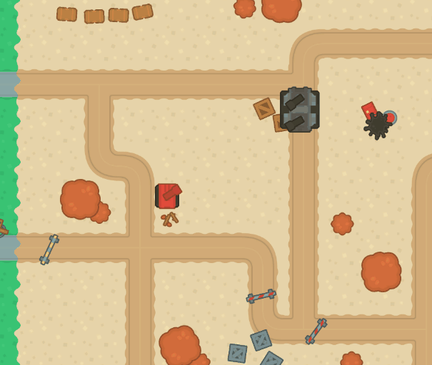
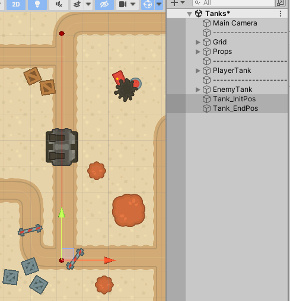
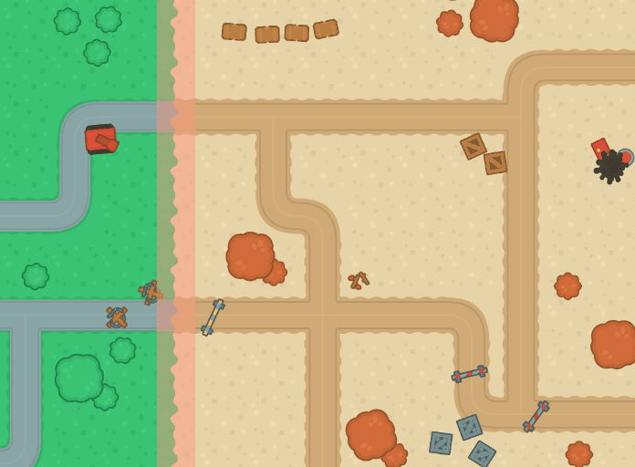
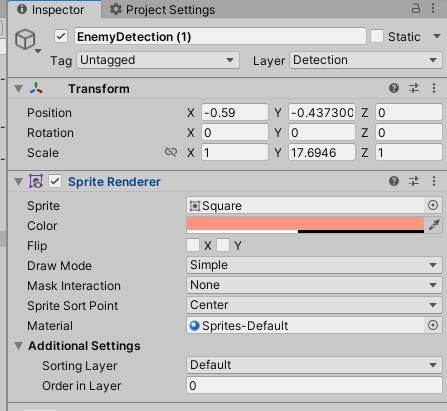

# Clase 3

## Taller #2

### Tank Enemy



1. Crear un tanque enemigo con **dos** cañones
2. Crear el script *TankEnemy* y agregar el código necesario para que la torreta se mueva entre dos puntos.
    1. Los dos puntos deben ser objetos vacios en la escena.
        
        
        
        
        > 🆘 [Mathf.PingPong](https://stackoverflow.com/questions/61306895/what-does-unitys-mathf-pingpong-actually-do) puede ayudarlo a desarrollar ese movimiento de “ir y venir”. Puede combinar con [Vector3.Lerp](https://docs.unity3d.com/ScriptReference/Vector3.Lerp.html).

        
3. Hacer que cada cañon mire siempre al Jugador (*PlayerTank*).
    
    > 🆘 Deberá usar un Array (`[]`) o una Lista para manipularlos.

    

### Detector



1. Actualice el script *TankEnemy* para que, al darle Play, este se apague. 
    1. Haremos que se active cuando el Jugador entre a nuestra zona roja.
    
    > 🆘 Recuerde el método **Start**. Y busque como activar/desactivar un objeto por código 😛

    
2. Crear un nuevo Objeto llamado *EnemyDetection*.
    1. Ubicarlo como muestra la imagen (GIF). 
    2. Configuración recomendada: Agregar un componente Sprite Renderer y usar un color sutil, para mostrar el rango que abarca.
        
        
        
3. Crear el script *TriggerDetection* y agregar el código y componentes necesarios para que cuando el jugador entre la zona, **active a nuestro tanque enemigo**.
    1. Además, este objeto debe ser **desactivado**, cuando se detecte que el Player entre a la zona.
    
    > 🆘 Recuerde los métodos **OnTriggerEnter2D** o **OnCollisionEnter2D**. Y que debe agregar un Collider al objeto.
    
    
4. Este objeto solo debe identificar cuando el Player entre a la zona. Posiblemente deba crear una nueva Layer para evitar problemas y comportamientos no deseados, por ejemplo, que pasa con los proyectiles que disparamos?
    
    > 🆘 Posiblemente también deba editar la [Matriz de collision](https://docs.unity3d.com/Manual/LayerBasedCollision.html) **2D.**
    
    

### Tank Enemy Shoot


1. Actualice el script *TankEnemy* para que este dispare al Jugador (*PlayerTank*).
    1. Debe de disparar una bala por cada cañon!
    2. Debe disparar cada X segundos.
    
    > 🆘 Hay varias formas de abordar este problema. Una de ellas, es crear un [Timer](https://gamedevbeginner.com/how-to-make-countdown-timer-in-unity-minutes-seconds/) (seccion ***How to make a timer in Unity (using Time.deltaTime)*** del enlace adjunto**).**
    
    
2. Debe crear un nuevo Prefab para este proyectil.
    1. Debe usar un Sprite distinto al del proyectil del Player.
    2. Las balas que dispara el enemigo, **solo** deben de desaparecer cuando estas impacten al *PlayerTanks* o un objeto del escenario. No deben interactuar con nada más.
    
    > 🆘 Posiblemente debe crear una nueva Layer y editar nuevamente la [Matriz de collision](https://docs.unity3d.com/Manual/LayerBasedCollision.html) **2D**.
    


### Fecha de entrega
> Viernes 03 de Mayo - 11:59 pm (media noche del viernes).

### Entrega
- Crear una branch a partir del branch `sessions/homework-2`.
  - El nombre de la nueva branch debe tener el siguiente formato: `student/[usuario-unal]/homework-2`
```
 Ejemplo: Si su correo es pedrito@unal.edu.co, la rama para hacer la entrega de la clase 3 debe ser `student/pedrito/homework-2`.
```
- Hacer los commits necesarios para efectuar la solución al taller.
- Hacer un Pull Request de su branch (`student/[usuario-unal]/homework-2`)
  - La branch target del PR debe ser `sessions/homework-2`.
  - El nombre del PR debe seguir el formato `Solución Taller 2 by [usuario-unal]`. 
```
 Ejemplo: Si su correo es pedrito@unal.edu.co, el título del PR debe ser: `Solución Taller 2 by pedrito`.
```
  - Puede usar la descripción del PR para añadir notas, aclaraciones, preguntas, etc.