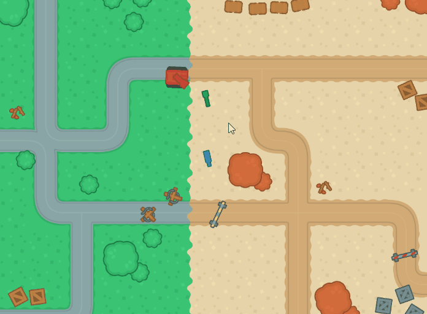
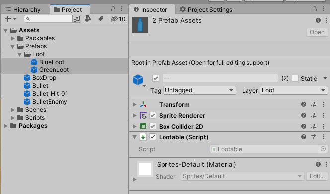
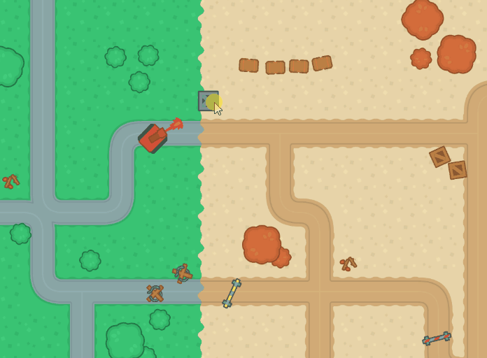

# Clase 3

## Taller #3

Guía paso a paso en [Notion](https://allie-joe.notion.site/Tank-2-293b7507760343ae99c2a3eac6bdf24f).

### Objeto Lootable



1. Cree el script **Lootable** y agregue la lógica necesaria para que:
    1. Gire en su propio eje.
    2. Cuando el Player toque el objeto, este se destruya e imprama en consola **Loot grabbed by Player.**
2. Cree las Layer necesarias, actualice la Matriz de collison y actualice los Prefab **Bullet** para que:
    1. Solo el Player interactue con ellos. Ningun otro objeto debe de afectarles.
3. Cree dos Prefabs (puede usar los Sprites que desee).
    
    
    

### Objeto Droppable



1. Cree el script **Droppable** que al recibir suficiente daño, el objeto se destruya y genere/cree un objeto para recoger/coleccionar (loot - del punto anterior).
    1. Debe usar/implementar la interfaz ***IDamageable.***
    2. Debe tener un variable que indique la probabilidad de que genere loot al destruirse.
        
        <aside>
        🆘 Se sugiere utilizar la clase **Random** de Unity para generar numeros aleatorios.
        
        </aside>
        
    3. Debe tener una lista de posibles loots. Debe instanciar uno de ellos al azar.
    4. Los loots deben aparecer en un area alrededor de donde estaba el objeto Drop → **No** en la exacta misma posición!
        
        <aside>
        🆘 **Random.insideUnitCircle** puede serle útil.
        
        </aside>
        
    
    
    
2. Cree las Layer necesarias, actualice la Matriz de collison y actualice los Prefab **Bullet** para que:
    1. Solo las balas del Player impacten a estos objeto.
    2. El Player pueda colisionar con ellos → detener su movimiento.

### Fecha de entrega
> Viernes 10 de Marzo - 11:59 pm (media noche del viernes).

### Entrega
- Crear una branch a partir del branch `sessions/homework-3`.
  - El nombre de la nueva branch debe tener el siguiente formato: `student/[usuario-unal]/homework-3`
```
 Ejemplo: Si su correo es pedrito@unal.edu.co, la rama para hacer la entrega de la clase 3 debe ser `student/pedrito/homework-3`.
```
- Hacer los commits necesarios para efectuar la solución al taller.
- Hacer un Pull Request de su branch (`student/[usuario-unal]/homework-3`)
  - La branch target del PR debe ser `sessions/homework-3`.
  - El nombre del PR debe seguir el formato `Solución Taller 3 by [usuario-unal]`. 
```
 Ejemplo: Si su correo es pedrito@unal.edu.co, el título del PR debe ser: `Solución Taller 3 by pedrito`.
```
  - Puede usar la descripción del PR para añadir notas, aclaraciones, preguntas, etc.

- Trabajar sobre el proyecto existente. No debe de crear nuevos proyectos de Unity!
