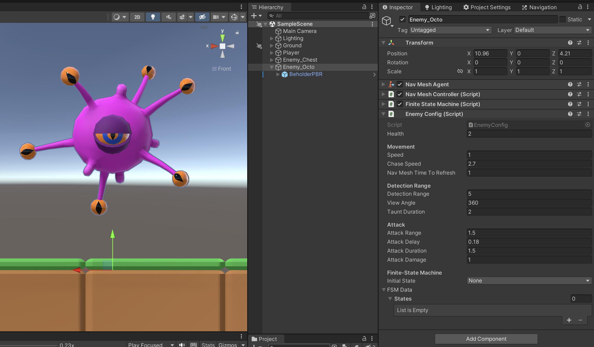
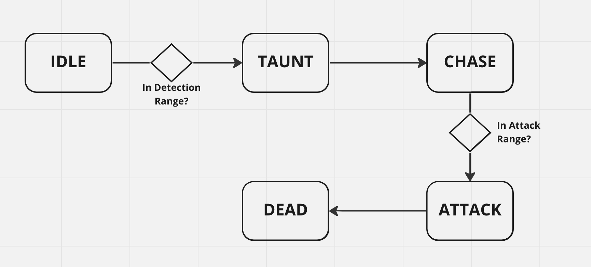

# Clase 7

## Taller #4

Guía paso a paso en [Notion](https://allie-joe.notion.site/Enemy-AI-07c73d9ef96e466591c7915c1d367e60).

> 🚨 En la escena encontrará un nuevo objeto llamado **Enemy_Octo:**
>  - Debe trabajar sobre este objeto.
>  - Sus animaciones ya están configuradas respecto a lo esperado de la tarea. En la medida de lo posible, no cambiarlas.




### Enemigo Octo y su Estado de Máquia

**Contexto:** Queremos implementar el siguiente estado de máquina para nuestro enemigo Octo.



Explicación del diagrama:

1. **Estado Idle**: Este estado no tiene ningún comportamiento en particular (usualmente es el estado por default, en el que el personaje solo esta ahí… *existiendo).*
2. **Idle → Taunt**: Debe ocurrir cuando el Player entre al rango de Detectión. En este caso no nos interesa saber en que dirección esta el player o si esta dentro del rango (ángulo) de visión, solo nos interesa saber si esta dentro del rango.
3. **Estado Taunt:** Pequeño delay antes de comenzar a perseguir al Player. Debe reproducir la animación “Taunt” (de nuevo, recuerde que el Animator ya esta configurado. No debería necesitar hacer cambios al respecto).
4. **Taunt → Chase:** Debe pasar automáticamente, luego de X segundos.
5. **Chase**: Perseguir al Player.
6. **Chase → Attack**: Debe ocurrir cuando el Player este en el rango de Ataque.
7. **Attack**: Debe atacar al Player. Pero esta vez con un ataque en área.
8. **Attack → Dead**: Debe ocurrir después de X segundos.
9. **Dead**: Debe apagar el objeto *Enemy_Octo*.

### Idle y Taunt

1. Cree el estado Idle. Llamarlo **IdleState.** Este estado no hace nada en particular.
    
> ⚠️ Por cada nuevo estado que cree (clase que herede de ***State***), deberá agregar el valor correspondiente al `StateType` y agregar el código correspondiente a `State.CreateState`

2. Cree el estado Taunt. Llamarlo **TauntState**.
    1. Debe ejecutar la animación “Taunt”.
    2. Utilice la variable `Config.TauntDuration` para definir cuanto tiempo debe de durar el estado.
3. Agregue la transición (en el objeto *Enemy_Octo*, en la Configuración del mismo) para que pase de Idle a Taunt cuando el Player entre en la zona de detección.
    1. Debe crear un nuevo **StateDecision.** Llamarlo ***InDetectionZoneCheck***. Recuerde que luego debe crear el scriptable object en la carpeta *Packable/Data/FSMDecision*
    2. Debe usar `Config.DetectionRange`
4. Agregar estos estados y la transición al objeto *Enemy_Octo*, en su configuración.

### **Taunt, Chase y Ataque**

1. Debe de pasar del estado Taunt al estado Chase sin ningún **StateDecision.**
2. Agregue el estado Chase y Ataque al objeto *Enemy_Octo*, en su configuración.
3. Debe pasar del estado Chase al estado Ataque, cuando el Player este dentro del Rango de ataque (`Config.AttackRange` → utilice `InAttackRangeCheck`).

### Ataque y Dead

1. Debe pasar del estado Ataque al estado Dead sin ningún **StateDecision.**
2. Cree el estado Dead. Llamarlo DeadState.
    1. Apague el objeto *Enemy_Octo*, cuando entre a este estado.
3. Agregue el estado Dead al objeto *Enemy_Octo*, en su configuración.

### Tipo de ataques: Basic y Explode

1. Cree un nuevo enum, llamado ***EnemyAttackType.*** 
    1. Agregue una variable de este tipo al EnemyConfig. Por defecto debe ser `Basic`
    
    ```csharp
    public enum EnemyAttackType {Basic, Explode }
    ```
    
2. Actualice el código de **AttackState**, para que:
    1. Si el ataque es tipo `Basic`, utilice el código que tenemos actualmente:
        
        ```csharp
                private void BasicAttack(FiniteStateMachine fms, float deltaTime)
            {
                if (fms.Target.TryGetComponent(out IDamageable target))
                {
                    target.TakeHit(fms.Config.AttackDamage);
                }
            }
        
            private void ExplodeAttack(FiniteStateMachine fms, float deltaTime)
            {
                Collider[] collidersInRange = Physics.OverlapSphere(
                    fms.transform.position + Vector3.up * 0.5f, 
                    fms.Config.AttackRange);
        
                for (int i = 0; i < collidersInRange.Length; i++)
                {
                    if (collidersInRange[i].TryGetComponent(out IDamageable target))
                    {
                        target.TakeHit(fms.Config.AttackDamage);
                    }
                }
            }
        ```
        
    2. Si el ataque es tipo `Explode`, deberá de encontrar a todos los **IDamageable** en alrededor de el y tratar de aplicarles daño.
        1. Encuentre todos los colliders que están cerca de el. Sugerencia, utilice `Physics.OverlapSphere`.
        2. Utilice `Config.AttackRange` para el rango de ataque.
        3. A cada uno de los colliders que encontró, verifique si tienen un componente **IDamageable.** En caso afirmativo, aplíqueles daño y utilice `Config.AttackDamage`como el valor del daño.
        

### Fecha de entrega
> Sábado 8 de Abril - 11:59 pm (media noche del sábado).

### Entrega
- Crear una branch a partir del branch `sessions/homework-4`.
  - El nombre de la nueva branch debe tener el siguiente formato: `student/[usuario-unal]/homework-4`
```
 Ejemplo: Si su correo es pedrito@unal.edu.co, la rama para hacer la entrega de la tarea 4 debe ser `student/pedrito/homework-4`.
```
- Hacer los commits necesarios para efectuar la solución al taller.
- Hacer un Pull Request de su branch (`student/[usuario-unal]/homework-4`)
  - La branch target del PR debe ser `sessions/homework-4`.
  - El nombre del PR debe seguir el formato `Solución Taller 4 by [usuario-unal]`. 
```
 Ejemplo: Si su correo es pedrito@unal.edu.co, el título del PR debe ser: `Solución Taller 4 by pedrito`.
```
  - Puede usar la descripción del PR para añadir notas, aclaraciones, preguntas, etc.

- Trabajar sobre el proyecto existente. No debe de crear nuevos proyectos de Unity!
